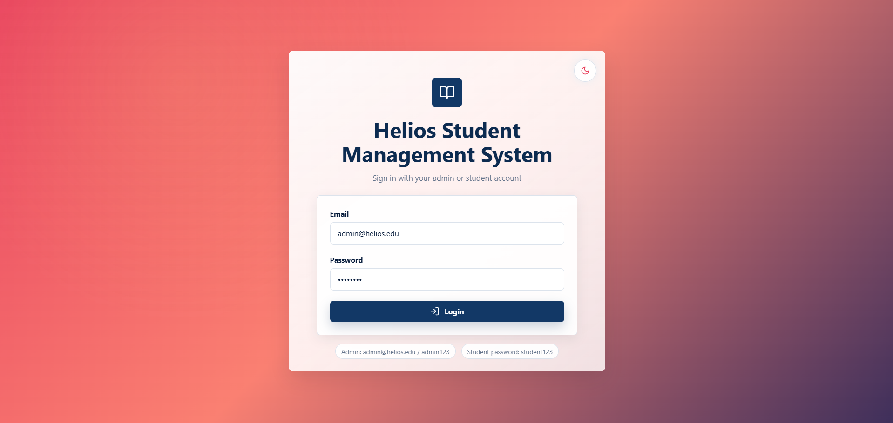
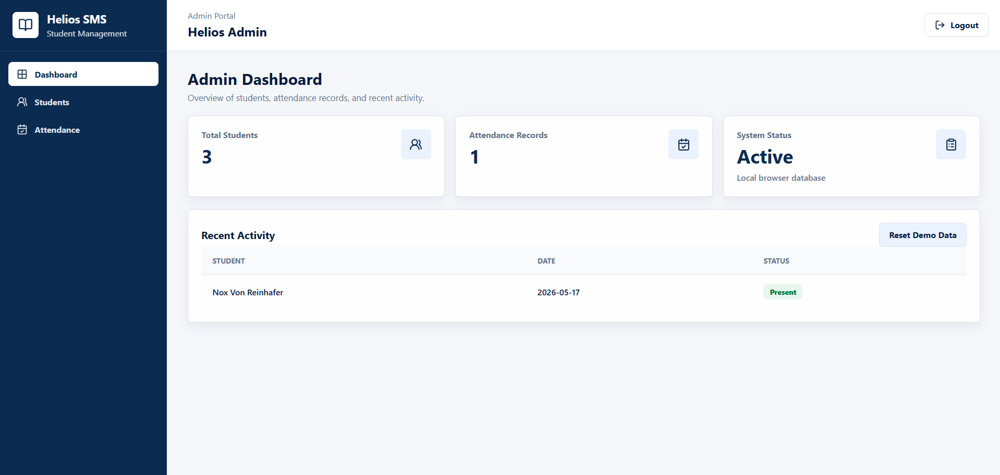
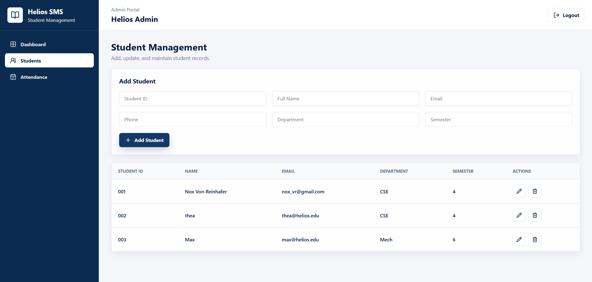
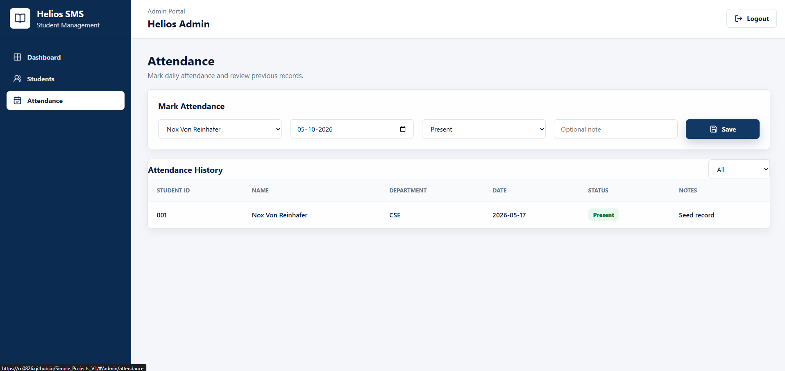
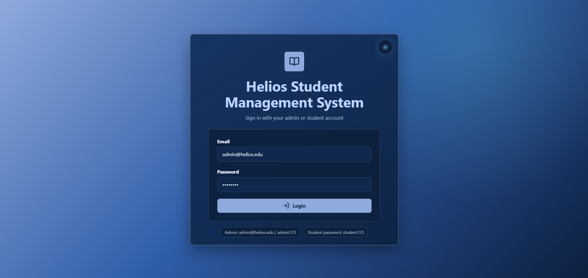

# Helios Student Management System — Frontend

> A React-based student management dashboard built to explore role-based application flows, client-side data management, attendance tracking, and responsive dashboard UI.

**Live Application:** [React Application](https://rn0826.github.io/Simple_Projects_V1/)

---

## Overview

Helios Student Management System (Frontend Version) is a **React + Vite** application with separate administrator and student interfaces.

The current application runs entirely in the browser. Student records, attendance records, theme preferences, and the active session are persisted using `localStorage`.

The frontend is structured so that the current browser-storage layer can later be replaced by a backend/API layer without requiring the UI to be completely redesigned.

### Current architecture

```text
React UI
   |
   v
Application / Page Components
   |
   v
storage.js
   |
   v
Browser localStorage
```

### Planned architecture

```text
React UI
   |
   v
Application / API Layer
   |
   v
Backend
   |
   v
Database
```

---

## Features

### Authentication & Role-Based Access

- Admin and student login flows.
- Client-side session persistence.
- Role-aware route protection.
- Unauthenticated users are redirected to the login page.
- Users attempting to access another role's area are redirected to their own dashboard.
- Logout functionality.

### Admin Portal

- Admin dashboard with system statistics.
- Student management.
- Add, edit, and delete student records.
- Duplicate student ID validation.
- Duplicate email validation when adding students.
- Attendance record management.
- Attendance filtering by status.
- Recent attendance activity.
- Demo data reset functionality.

### Student Portal

- Student dashboard.
- Student profile information.
- Attendance statistics.
- Attendance percentage calculation.
- Recent attendance overview.
- Complete personal attendance history.

### UI & Experience

- Light and dark themes.
- Responsive dashboard layout.
- Reusable React components.
- Status badges for attendance states.
- Lucide icon integration.
- Structured forms and tables.
- Hash-based routing for GitHub Pages deployment.

---

## Screenshots

### Light Mode

#### Login



#### Admin Dashboard



#### Student Management



#### Attendance Management



### Dark Mode

#### Login



---

## Application Flow

```text
Login
 |
 +-- Admin
 |    +-- Dashboard
 |    +-- Students
 |    +-- Attendance
 |
 +-- Student
      +-- Dashboard
      +-- My Attendance
```

---

## Technology Stack

| Technology | Purpose |
|---|---|
| React | UI development |
| Vite | Development server and production build |
| React Router | Application routing |
| JavaScript (ES Modules) | Application logic |
| CSS | Styling and responsive layouts |
| Lucide React | Interface icons |
| localStorage | Client-side persistence |
| GitHub Pages | Deployment |

The frontend uses React 18, Vite 6, React Router DOM 6, and Lucide React as defined by the project's `package.json`.

---

## Project Structure

```text
Helios_SMS_FV1/
└── frontend/
    ├── src/
    │   ├── components/
    │   │   ├── StatCard.jsx
    │   │   ├── StatusBadge.jsx
    │   │   └── ThemeToggle.jsx
    │   ├── data/
    │   │   ├── id.js
    │   │   ├── seedData.js
    │   │   └── storage.js
    │   ├── layouts/
    │   │   └── DashboardLayout.jsx
    │   ├── pages/
    │   │   ├── AdminDashboard.jsx
    │   │   ├── Attendance.jsx
    │   │   ├── Login.jsx
    │   │   ├── StudentAttendance.jsx
    │   │   ├── StudentDashboard.jsx
    │   │   └── Students.jsx
    │   ├── styles/
    │   │   ├── base.css
    │   │   ├── dashboard.css
    │   │   ├── forms.css
    │   │   ├── login.css
    │   │   ├── tables.css
    │   │   └── variables.css
    │   ├── App.jsx
    │   └── main.jsx
    ├── index.html
    ├── package.json
    ├── package-lock.json
    └── vite.config.js
```

---

## Application Architecture

### `App.jsx`

Defines the application routes and the `RequireRole` component used to protect admin and student routes.

Current routes:

```text
/login
/admin
/admin/students
/admin/attendance
/student
/student/attendance
```

### `DashboardLayout.jsx`

Provides the shared dashboard shell:

- Sidebar navigation.
- Role-specific navigation.
- Top header.
- Logout functionality.
- Page headings.
- Student identification for student accounts.

### `storage.js`

Acts as the application's client-side data layer.

It handles:

- Student retrieval and management.
- Attendance retrieval and storage.
- Authentication.
- Session persistence.
- Theme persistence.
- Demo data reset.
- Student-specific attendance retrieval.

This separation keeps the UI components independent from the exact storage implementation.

---

## Data Model

### Student

```text
Student
├── id
├── name
├── email
├── phone
├── department
└── semester
```

### Attendance

```text
Attendance Record
├── id
├── studentId
├── date
├── status
└── notes
```

Supported attendance statuses include:

- Present
- Absent
- Late
- Excused

### User Session

The active session stores role information and the relevant user/student identity in browser storage.

---

## Demo Credentials

This is a demonstration frontend, so credentials are intentionally defined client-side.

### Admin

```text
Email:    admin@helios.edu
Password: admin123
```

### Student

Seeded student accounts use:

```text
Password: student123
```

The login screen exposes the demo credentials because the application is intended for demonstration and portfolio purposes.

---

## Running Locally

### 1. Clone the repository

```bash
git clone https://github.com/RN0826/Simple_Projects_V1.git
```

### 2. Navigate to the frontend

```bash
cd "Simple Projects V1/Helios_SMS_FV1/frontend"
```

### 3. Install dependencies

```bash
npm install
```

### 4. Start the development server

```bash
npm run dev
```

Vite will provide a local development URL in the terminal.

### 5. Create a production build

```bash
npm run build
```

### 6. Preview the production build

```bash
npm run preview
```

---

## GitHub Pages Deployment

The frontend is deployed through GitHub Actions as part of the repository's GitHub Pages site.

The Vite configuration uses:

```js
base: "./"
```

which allows the built application to work within the repository's Pages deployment structure.

### Live Application

**[Open Helios Student Management System](https://rn0826.github.io/Simple_Projects_V1/)**

---

## Data Persistence

The application does not currently use a remote database.

Instead, it stores application data in the browser using `localStorage`.

This allows the project to demonstrate:

- CRUD operations.
- Session handling.
- Attendance management.
- Persistent theme preferences.
- Data initialization and reset behavior.

Because the data is browser-local, changes made in one browser/device are not synchronized with other users or devices.

---

## Security & Production Disclaimer

> **This is a frontend demonstration project, not a production authentication system.**

Authentication and role information are handled client-side, and application data is stored in browser `localStorage`.

There is currently:

- No backend authentication service.
- No server-side authorization.
- No remote database.
- No production session management.

A production implementation would move authentication, authorization, validation, and persistent data management to a trusted backend.

---

## Future Architecture

The current `storage.js` abstraction provides a natural boundary for introducing a backend later.

```text
Current

React
  |
  v
storage.js
  |
  v
localStorage


Future

React
  |
  v
API / Service Layer
  |
  v
Backend
  |
  v
Database
```

Possible future backend responsibilities include:

- Secure authentication.
- Role-based authorization.
- Student CRUD APIs.
- Attendance APIs.
- Server-side validation.
- Persistent database storage.
- User/session management.

---

## Known Limitations

The current version is intentionally focused on the frontend and demonstration workflow.

- Client-side authentication.
- Browser-only data persistence.
- No real backend.
- No shared multi-user database.
- No automated test suite yet.
- Role protection is frontend-only.
- Demo credentials are intentionally visible.

---

## Development Focus

This project was built to practice and demonstrate:

- React component architecture.
- Routing and protected routes.
- Role-based UI flows.
- State management with React hooks.
- CRUD-style frontend operations.
- Client-side persistence.
- Data validation.
- Responsive dashboard design.
- Reusable components.
- Separation between UI and data-access logic.
- GitHub Actions and GitHub Pages deployment.

---

## Roadmap

### Near Term

- [ ] Complete storage-layer validation improvements.
- [ ] Add automated tests for `storage.js`.
- [ ] Harden session parsing and client-side error handling.
- [ ] Improve accessibility labels for icon-only controls.
- [ ] Improve synchronization after storage changes.

### Future

- [ ] Introduce a backend API.
- [ ] Replace `localStorage` with persistent database storage.
- [ ] Implement secure authentication.
- [ ] Move authorization to the backend.
- [ ] Add automated component and integration testing.
- [ ] Expand student and academic management features.

---

## Project Status

**Frontend Version — Functional Demo**

The application currently provides a working student-management interface with separate administrator and student experiences and is deployed publicly through GitHub Pages.

---

## Author

**Rahul SP**

Part of the [`Simple_Projects_V1`](https://github.com/RN0826/Simple_Projects_V1) project collection.
