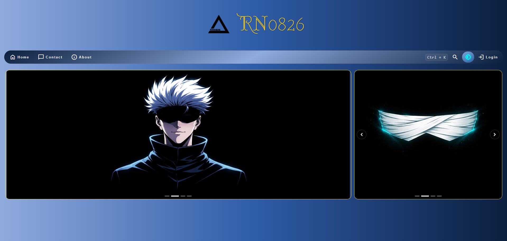
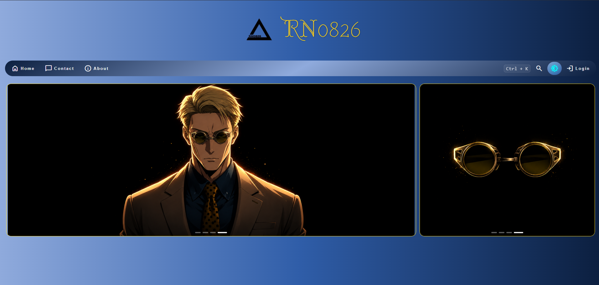
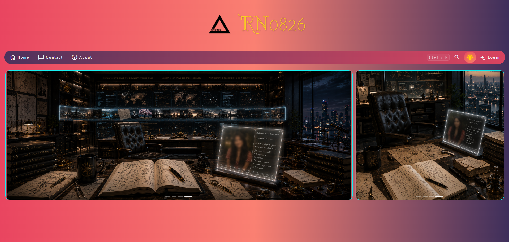
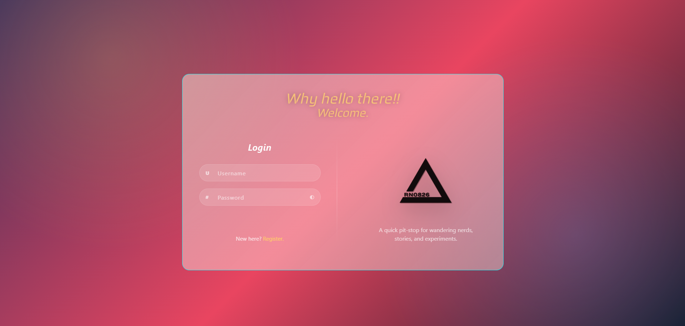
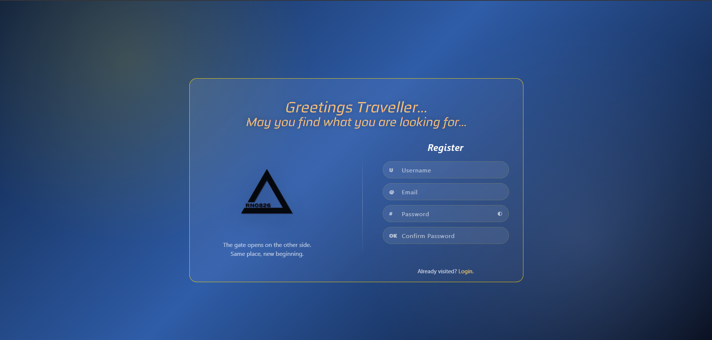

# RN0826 Website

> *A quick pit-stop for a nerd.*

**A modular frontend project exploring storytelling, philosophy, interactive UI, and reusable web architecture.**

View the live website here:

**[Live Website](https://rn0826.github.io/Simple_Projects_V1/rn0826/)**

---

# 📸 Hero Preview



---

# About

RN0826 is a personal frontend laboratory where interface design, storytelling, animation, and philosophy meet.

Rather than serving as a conventional portfolio website, RN0826 is designed as an evolving platform that experiments with reusable UI components, modular frontend architecture, and immersive visual presentation.

Every major feature is treated as part of a larger design system instead of being built as an isolated page.

---

## Current Status

RN0826 is currently in active development.

The homepage experience is feature-complete as an MVP, while additional pages and authentication workflows are being refined for future releases.

---

# Screenshots

## Homepage — Dark Mode



---

## Homepage — Light Mode



---

# Authentication Prototype

The authentication system is currently under active development.

At present, the project includes:

- Login Prototype (Light Theme)
- Register Prototype (Dark Theme)

The remaining theme variants will be added as the authentication system approaches Version 1.

---

## Login Prototype

Current implementation (Light Theme)



---

## Register Prototype

Current implementation (Dark Theme)



---

# Highlights

## 🎭 Dual Council Carousel

- Landscape and portrait carousels synchronized together
- Dynamic quote loading from JSON
- Animated quote transitions
- Independent Light and Dark Council experiences

## 📜 Dynamic Quote Engine

Quotes are loaded dynamically from `data/quotes.json`.

Each Council member supports Primary, Companion and Counterpoint statements, allowing new combinations without modifying the HTML.

## 🌗 Dual Theme Identity

Light and Dark Mode are intentionally designed as distinct visual identities rather than simple color inversions.

## 🔍 Integrated Search

- Keyboard shortcut support
- Animated reveal
- Responsive behaviour

## 🔐 Authentication Prototype

A standalone prototype exploring animated transitions, password validation, password visibility and registration workflow before integration into the main application.

---

# Architecture

```text
RN0826_WebSite
│
├── CSS
├── JavaScript
├── Data
└── Assets
    ├── Images
    └── Screenshots
```

---

# Design Philosophy

RN0826 is built around the belief that frontend interfaces should tell a story. Animations, typography, themes and layouts are treated as narrative tools rather than decorative effects.

---

# Technologies

| Technology | Purpose |
|------------|---------|
| HTML5 | Semantic structure |
| CSS3 | Styling, layout and animation |
| Vanilla JavaScript | Interactive behaviour |
| JSON | Dynamic Council statements |
| BrowserSync | Local development |

---

# Running Locally

```bash
browser-sync start --server --files "**/*.html, **/*.css, **/*.js, data/*.json"
```

---

# Roadmap

## Version 1

- ✅ Homepage
- ✅ Theme System
- ✅ Dual Carousel
- ✅ Search Interface
- ✅ Login Prototype

## Version 2

- ⏳ Register Integration
- ⏳ About Page
- ⏳ Contact Page
- ⏳ Blog

## Version 3

- ⏳ Backend Authentication
- ⏳ User Accounts
- ⏳ User Preferences
- ⏳ CMS

---

# Repository Structure

```text
RN0826_WebSite/
├── .agents/
├── assets/
│   ├── images/
│   └── screenshots/
├── CSS/
├── JavaScript/
├── data/
├── TEMP/
├── index.html
└── auth-register-dummy.html
```

---

# Behind the Project

RN0826 serves as a personal frontend laboratory where new interface ideas are developed as standalone prototypes before being integrated into the main website.

---

# Future Vision

- User Accounts
- Story Showcase
- Interactive Timeline
- Character Pages
- Blog
- CMS

---

# Author

**Rahul SP**

GitHub: https://github.com/RN0826

Repository:
https://github.com/RN0826/Simple_Projects_V1/tree/master/Simple%20Projects%20V1/RN0826_WebSite
